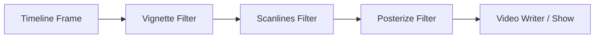

# DEMO PROCEDURAL

La demo es una pieza de software artístico procedural de 48 segundos de duración que corre a 30 FPS, estructurada en 6 escenas de 8 segundos cada una.
La paleta de colores se ha redefinido para usar exclusivamente tonos rojos y grises.
Al correr la demo se exporta el video en formato mp4 en la misma carpeta.

---

# 1. Estructura de las Escenas y Ecuaciones

## Escena 0: Créditos
* **Fondo**: Degradado vertical de gris muy oscuro (valor 15) a gris medio (valor 90), con una sutil onda sinusoidal dinámica sobre el brillo:
  $$\text{Valor}(y, t) = 35 + 40(1 - y) + 4.8\sin(1.2t + 2y)$$
* **Estrellas Procedurales**: Se generan 380 coordenadas pseudoaleatorias fijando una semilla determinista (`np.random.default_rng(1)`). Para mantener la coherencia de color, los píxeles se colorean usando indexación avanzada de NumPy divididos en tercios:
  * Rojo BGR `[50, 50, 240]`
  * Blanco BGR `[220, 220, 220]`
  * Gris BGR `[160, 160, 160]`
* **Efecto Glow (Resplandor de Neón)**: El texto principal `"DEMO PROCEDURAL"` se dibuja dos veces usando `cv2.putText`:
  1. Primero con un grosor de `5` y un color rojo oscuro, sirviendo como halo de resplandor.
  2. Encima con un grosor de `2` y un color rojo brillante/blanquecino para el núcleo del texto.

---

## Escena 1: Curva de Lissajous
* **Propósito**: Dibujar figuras geométricas tridimensionales oscilantes proyectadas en 2D.
* **Ecuaciones Matemáticas**:
  $$x(\theta) = \sin(a \cdot \theta + \delta)$$
  $$y(\theta) = \sin(b \cdot \theta)$$
  Donde $\theta \in [0, 2\pi]$.
* **Parámetros Dinámicos**:
  Para hacer que la curva oscile y cambie de forma con el tiempo $t$:
  * Frecuencia en X: $a(t) = 5 + 1.5\sin(t)$
  * Frecuencia en Y: $b(t) = 4 + 1.2\cos(1.2t)$
  * Diferencia de Fase: $\delta(t) = \frac{\pi}{4} + 0.8\sin(1.5t)$
* **Aplicación**: Renders en un fondo degradado rojo profundo. El color de la curva transiciona su saturación en HSV en función de $\sin(2.5t)$, pasando de blanco/gris a rojo brillante. Se aplica el efecto *glow* dibujando la curva primero con grosor `5` (rojo oscuro difuminado) y luego con grosor `2` (color base).

---

## Escena 2: Flor
* **Propósito**: Generar curvas simétricas en forma de pétalos florales que giran sobre su propio eje.
* **Ecuaciones Matemáticas**:
  En coordenadas polares, la ecuación de una rosa es:
  $$r(\theta) = \cos(k \cdot \theta)$$
  Convertido a coordenadas cartesianas y aplicando rotación dinámica $\theta_0$:
  $$x(\theta) = r(\theta) \cdot \cos(\theta + \theta_0)$$
  $$y(\theta) = r(\theta) \cdot \sin(\theta + \theta_0)$$
  Donde $\theta \in [0, 2\pi]$ y la velocidad de rotación es $\theta_0(t) = 2.5t$.
* **Parámetros**:
  * $k = 6$: Define que la flor tenga exactamente 6 pétalos (número par implica $k$ pétalos cuando $k$ es par en esta ecuación específica).
* **Círculos "Beats"**: Se dibujan 8 círculos en la parte inferior de la pantalla cuyas posiciones X están espaciadas uniformemente. Sus radios se modulan de forma armónica según el tiempo y su índice:
  $$r_{\text{beat}}(t, i) = \max(1, 22 + 15\sin(6t + 0.8i))$$
  Los círculos alternan colores entre gris y rojo según si su índice $i$ es par o impar.

---

## Escena 3: Espirógrafo / Hipotrocoide
* **Propósito**: Simular un espirógrafo físico que dibuja trayectorias de curvas hipotrocoides que mutan en el espacio.
* **Ecuaciones Matemáticas**:
  $$x(\theta) = (R - r)\cos(\theta) + d\cos\left(\frac{R - r}{r}\theta + \phi_x(t)\right)$$
  $$y(\theta) = (R - r)\sin(\theta) - d\sin\left(\frac{R - r}{r}\theta + \phi_y(t)\right)$$
  Donde $\theta \in [0, 16\pi]$ para cerrar el ciclo de vueltas del engranaje.
* **Parámetros**:
  * Radio del círculo mayor: $R = 13.0$
  * Radio del círculo menor: $r = 5.0$
  * Distancia del punto de lápiz: $d = 8.0$
  * Moduladores de fase: $\phi_x(t) = 0.4\sin(1.8t)$ y $\phi_y(t) = 0.4\cos(1.5t)$
* **Aplicación**: Genera curvas densas y entrelazadas sobre un fondo rojo. La fase de rotación oscilan con el tiempo.

---

## Escena 4: Partículas
* **Propósito**: Mostrar un flujo constante de partículas.
* **Ecuaciones Matemáticas**:
  Se posicionan 1200 partículas de forma aleatoria y se recalculan sus desplazamientos mediante ondas sinusoidales cruzadas dependientes del tiempo:
  $$x_{\text{new}} = (x + 110\sin(y/55.0 + 4t) + 40\cos(1.8t)) \pmod W$$
  $$y_{\text{new}} = (y + 85\cos(x/75.0 + 3t) + 30\sin(2.2t)) \pmod H$$
* **Aplicación**: Las partículas se dividen en dos grupos (mitad rojas y mitad grises). Se aplica un ligero desenfoque gaussiano de radio `1.1` para simular dispersión de luz y profundidad.

---

## Escena 5: Fuego Procedural
* **Propósito**: Simular la convección física y radiación térmica de una llama usando matrices de calor y colorización HSV.
* **Algoritmo y Ecuaciones**:
  1. **Disipación (Enfriamiento)**: En cada frame, la matriz de calor se multiplica por un factor de enfriamiento:
     $$Heat_{t}(y, x) = Heat_{t-1}(y, x) \times 0.93$$
  2. **Inyección de Calor**: En la base (zona inferior, $y \in [0.82H, H]$), se inyectan 1400 puntos de calor con valores aleatorios modulados por un pulso oscilante:
     $$Heat(y, x) += \text{random} \times (0.8 + 0.6(0.5 + 0.5\sin(5t)))$$
  3. **Convección**: El calor sube debido a que los datos de la matriz se desplazan 2 píxeles hacia arriba en cada iteración:
     $$Heat(y - 2, x) = Heat(y, x)$$
  4. **Difusión (Blur)**: Se aplica un desenfoque gaussiano ($\sigma = 2.2$) a la matriz de calor para simular la disipación térmica del aire.
  5. **Mapeo a Color (HSV)**: La matriz de calor de valores flotantes se mapea a canales HSV de OpenCV:
     * **Tono (H)**: $0$ (Rojo puro para todo el rango).
     * **Saturación (S)**: Se reduce drásticamente para las temperaturas más altas para volver blanco/gris el núcleo de la llama:
       $$S = 245 \times \left(1.0 - \text{clip}(Heat - 0.4, 0.0, 0.6) \times 1.6\right)$$
     * **Valor (V)**: Aumenta proporcionalmente al calor:
       $$V = 15 + 240 \times \text{clip}(Heat, 0.0, 1.0)$$
  6. **Elementos Adicionales**: Se dibuja un suelo rectangular de color gris carbón y se superponen 160 chispas de color mezclado (rojo y gris) que suben de forma difusa.

---

# 2. Transformaciones de Coordenadas e Interpolaciones

## Muestreo y Transformación de Pantalla (`poly_param`)
Las funciones matemáticas continuas se transforman a coordenadas de píxeles discretas en pantalla a través de la función `poly_param`:
1. **Muestreo**: Se evalúa la función sobre un rango denso usando `np.linspace(t0, t1, n)`.
2. **Escalamiento y Traslación**: Los valores continuos de la función (cuyos rangos suelen ser $[-1, 1]$) se escalan mediante factores de tamaño ($s_x, s_y$) y se trasladan a los centros de pantalla ($c_x, c_y$):
   $$X_{\text{pixel}} = X_{\text{continuo}} \cdot s_x + c_x$$
   $$Y_{\text{pixel}} = Y_{\text{continuo}} \cdot s_y + c_y$$
3. **Discretización**: Los valores de punto flotante se redondean a enteros (`np.round`) y se reformatean a un arreglo de tipo `np.int32` con dimensiones `(-1, 1, 2)`, compatible con los algoritmos de dibujo vectorial de OpenCV (`cv2.polylines`).

---

## Interpolación de Transición (`smoothstep`)
Para realizar la mezcla de escenas e intensidades globales se utiliza la función `smoothstep`, una interpolación polinómica hermítica de tercer orden que suaviza la aceleración en los extremos en comparación con una interpolación lineal convencional:
$$\text{smoothstep}(a, b, x) = 3y^2 - 2y^3 \quad \text{donde } y = \text{clamp}\left(\frac{x - a}{b - a}, 0, 1\right)$$

* **Mezcla de Fotogramas**: En los últimos 1.2 segundos de cada escena, se calcula la interpolación $a = \text{smoothstep}(6.8, 8.0, t_{\text{local}})$. Se mezclan las imágenes usando combinación lineal ponderada:
  $$\text{Frame} = \text{BufA} \cdot (1 - a) + \text{BufB} \cdot a$$
* **Destello de Transición**: Un pequeño destello de luz blanca transiciona en el último instante mediante el peso de color blanco:
  $$\text{Frame} = \text{Frame} \cdot 1.0 + \text{Blanco} \cdot (0.12 \cdot \text{smoothstep}(7.6, 8.0, t_{\text{local}}))$$
* **Fade Global**: Se aplica un fade-in lineal suavizado en los primeros 1.5 segundos del vídeo general, y un fade-out simétrico en los últimos 1.5 segundos.

---

# 3. Filtros de Posprocesamiento

Al finalizar la renderización de cada fotograma, se le aplican tres filtros en cascada en la función `main` para mejorar la textura de la imagen:

```python
frame = post_vignette(frame, 0.72)
frame = post_scanlines(frame, 0.16)
frame = post_posterize(frame, 24)
```



### A. Viñeteado (`post_vignette`)
* **Ecuación**:
  Para cada coordenada $(x, y)$, se calcula la distancia cuadrática normalizada al centro de la pantalla:
  $$d_{\text{norm}}(x, y) = \left(\frac{x - W/2}{W/2}\right)^2 + \left(\frac{y - H/2}{H/2}\right)^2$$
  El brillo del píxel se atenúa en función de esta distancia multiplicada por la fuerza $S_{\text{vignette}} = 0.72$:
  $$\text{Píxel}_{\text{out}} = \text{Píxel}_{\text{in}} \times \text{clamp}(1.0 - S_{\text{vignette}} \cdot d_{\text{norm}}(x, y), 0.0, 1.0)$$
* **Por qué se aplica**: Simula las características de las lentes de cámaras analógicas clásicas, oscureciendo los bordes de la pantalla.

### B. Líneas de Escaneo (`post_scanlines`)
* **Ecuación**:
  Se aplica un patrón oscilatorio sinusoidal horizontal dependiente únicamente de la fila vertical $y$:
  $$\text{Modulación}(y) = 1.0 - S_{\text{scan}} \cdot \left(0.5 + 0.5\sin\left(\frac{2\pi y}{3}\right)\right)$$
  Donde la fuerza del filtro es $S_{\text{scan}} = 0.16$.
* **Por qué se aplica**: Este filtro rompe la "limpieza" artificial de los gráficos digitales planos, dándole textura de pantalla analógica de fósforo y ocultando la pixelación dura del aliasing.

### C. Posterización (`post_posterize`)
* **Ecuación**:
  Se realiza una cuantización de niveles de color dividiendo los canales de los píxeles por un factor de paso $Q = 24$, aplicando división entera y luego volviendo a multiplicar:
  $$\text{Color}_{\text{out}} = \left\lfloor \frac{\text{Color}_{\text{in}}}{Q} \right\rfloor \times Q$$
* **Por qué se aplica**: Reduce la cantidad de colores disponibles en la imagen de 256 niveles a aproximadamente 10 niveles discretos por canal. 


# Resumen

### 1. Escenas y Ecuaciones

| Escena | Ecuación / Lógica principal | Comportamiento dinámico |
| :--- | :--- | :--- |
| **0. Créditos** | Posicionamiento determinista de estrellas. | Estrellas en rojo, blanco y gris. Texto en rojo con efecto de resplandor (*glow*). |
| **1. Lissajous** | $x = \sin(a\theta + \delta)$<br>$y = \sin(b\theta)$ | Las frecuencias ($a, b$) y la fase ($\delta$) varían con $\sin(t)$. El color oscila de rojo a blanco. |
| **2. Rosa Polar** | $r = \cos(6\theta)$<br>Rotación: $\theta + 2.5t$ | Flor de 6 pétalos giratoria. Abajo, 8 círculos con radios pulsantes que alternan rojo y gris. |
| **3. Espirógrafo** | Ecuación de hipotrocoide. | Curva compleja cuyos extremos oscilan dinámicamente con la fase $\phi(t)$. |
| **4. Partículas** | Deriva por campo de viento sinusoidal en X e Y. | 1200 partículas flotantes: 50% rojas y 50% grises con desenfoque gaussiano suave. |
| **5. Fuego** | Disipación de calor ($0.93$) + Convección hacia arriba + Gaussian Blur. | Matriz de calor coloreada en HSV (Tono 0 para rojo; saturación baja en el centro para dar gris/blanco). |

---

### 2. Transformaciones e Interpolaciones
* **Ajuste de pantalla (`poly_param`)**: Transforma las coordenadas continuas matemáticas $[-1, 1]$ a coordenadas discretas de píxeles:
  $$X_{\text{pixel}} = X \cdot \text{escala} + \text{centro}$$
* **Transiciones (`smoothstep`)**: Interpolación cúbica ($3u^2 - 2u^3$) para lograr desvanecimientos suaves en la entrada, salida y cambio entre escenas.

---

### 3. Filtros de Posprocesamiento

* **Vignette (Viñeteado)**: Oscurece los bordes en forma radial.
  * *Por qué*: Dirige la mirada del espectador al centro y aporta aspecto cinematográfico.
* **Scanlines (Líneas de escaneo)**: Modulación sinusoidal horizontal del brillo.
  * *Por qué*: Simula un monitor CRT retro y suaviza los bordes duros de los vectores.
* **Posterizado (Quantización)**: Agrupa el color en intervalos de 24 niveles.
  * *Por qué*: Reduce los gradientes suaves de color para dar un aspecto estilizado de videojuego clásico o *pixel-art*.


# CIUDAD

### 1. Paradigma de Modelado: Construcción Procedimental
Se utilizan primitivas geométricas básicas (puntos, líneas, triángulos y cuadriláteros) dibujadas mediante funciones del *fixed-function pipeline* clásico de OpenGL (`glBegin` / `glEnd`) y funciones de utilidad de GLU (como `gluSphere`).

---

### 2. Bloques de Construcción (Primitivas Básicas)
Para dar vida a los modelos, se desarrollaron funciones base que generan formas elementales con control de color y normales de iluminación:

*   **`plataforma_plana(lado1, lado2, altura, color)`**: Dibuja un plano horizontal rectangular usando `GL_QUADS`.
*   **`anillo_elipsoide(a1, b1, a2, b2, angulo_limite, capa, color)`**: Genera una banda circular o elíptica en el plano XZ usando `GL_QUAD_STRIP`. Calcula los límites internos y externos de los vértices trigonométricamente con `cos` y `sin`.
*   **`cubo(alto, ancho, largo, color_lados, color_arriba, color_abajo)`**: Define un paralelepípedo de 6 caras cuadriláteras (`GL_QUADS`). La clave aquí es que aplica una normal explícita (`glNormal3f`) para cada cara (por ejemplo, `(0.0, 0.0, 1.0)` para la cara frontal), lo que permite que las luces de la escena incidan de manera realista sobre el volumen.
*   **`piramide(alto, ancho, largo, altura_base, color)`**: Crea una pirámide de base cuadrangular usando `GL_TRIANGLES` para los costados. Llama a la función auxiliar `normal_tri` para calcular dinámicamente la normal unitaria de cada cara triangular mediante el producto cruzado de sus vectores.
*   **`esfera(radio, color)`**: Renderiza una esfera mediante la clase de utilidad cuadrática de GLU (`gluNewQuadric` y `gluSphere`).
*   **`cilindro_solido(ang_in, ang_fin, radio, largo, color)`**: Crea un cilindro cerrado. Usa un `GL_TRIANGLE_STRIP` para la pared lateral y dos `GL_TRIANGLE_FAN` (abanicos de triángulos) para sellar las tapas en ambos extremos.

---

### 3. Modelado de Objetos Complejos (Jerarquía de Transformaciones)
Los modelos complejos se construyen combinando las primitivas básicas dentro de bloques **`glPushMatrix()`** y **`glPopMatrix()`**. Esto crea una estructura jerárquica en la que las transformaciones (traslación, rotación y escalado) de una parte pueden afectar o no a las siguientes.

#### A. Viviendas (Infonavit)
*   **`infonavit` e `infonavit_sin_puerta`**: Representan casas de interés social de la ciudad.
    *   **Estructura**: El cuerpo de la casa es un gran `cubo`. Las ventanas son planos (`plataforma_plana`) rotados $90^\circ$ sobre el eje X y pegados ligeramente por delante de la pared frontal (`z = 2.01`) para evitar el efecto de parpadeo de texturas (*Z-fighting*).
    *   **Puertas deslizantes**: Son dos plataformas planas verticales que se desplazan a la izquierda y derecha mediante una variable `abrir`, revelando un fondo oscuro que simula el interior de la casa.

#### B. Torre Supersónica
*   **`torre_supersonica`**: Es el edificio futurista principal.
    *   **Pilar central**: Un cilindro sólido alto y delgado.
    *   **Anillos decorativos**: Dos `anillo_elipsoide` a media altura que rotan de manera continua en sentido de las manecillas del reloj.
    *   **Platillo de la cima**: Compuesto por anillos elipsoides horizontales concéntricos, una cabina cilíndrica central y una **cúpula de cristal**. Para la cúpula, se habilita la mezcla de colores (`GL_BLEND`) y se dibuja una esfera con un color celeste que posee un valor alfa de `0.45` para lograr transparencia.
    *   **Antena**: Un cilindro muy delgado con una esfera roja autoluminosa en la punta.

#### C. Dron Policial y Robots
*   **`dron_policial`**: Consta de un cuerpo central (`cubo` negro), una luz piloto esférica y una hélice superior formada por dos finos cubos cruzados. La hélice gira rápidamente en base al tiempo (`glRotatef(t * 1500.0, 0.0, 1.0, 0.0)`).
*   **`robot_patrulla`**: Un chasis cúbico con propulsores cilíndricos en los costados y un faro esférico brillante de color cian al frente.
*   **`camara_vigilancia_rotatoria`**: Un poste vertical que sostiene una cabeza cúbica que rota horizontalmente y se inclina hacia abajo, simulando un barrido de vigilancia con un lente esférico rojo.

#### D. Habitantes (Personas y Patinetas)
*   **`dibujar_persona_supersonica`**: La silueta humana se modela con una esfera para la cabeza y cilindros sólidos para el torso, los brazos y las piernas. Recibe parámetros de rotación para cada extremidad (`ang_brazo_iz`, etc.) para poder simular poses o movimientos.
*   **`dibujar_persona_caminando`**: Utiliza el modelo anterior y calcula las oscilaciones de las extremidades con una función senoidal en función del tiempo (`30.0 * math.sin(t * 4.0)`). Así, mientras un brazo va hacia adelante, el otro va hacia atrás, recreando el ciclo de caminata.
*   **`dibujar_persona_en_patineta`**: Dibuja una tabla (`cubo`) y cuatro pequeñas ruedas (`esfera`). Coloca encima al personaje humano en una pose estática de equilibrio.

#### E. El Monstruo
*   **`monstruo`**: Es una criatura orgánica modelada con geometría puramente esférica.
    *   El cuerpo se divide en tres niveles o "capas" de esferas verdes de distintos tamaños distribuidas circularmente en base a ángulos trigonométricos (`i * 45` grados, etc.).
    *   Para dar un efecto orgánico, el tamaño del cuerpo oscila ligeramente usando escalado por tiempo (`glScalef(1 * a, 1 * a, 1 * a)` donde `a` depende de `sin(t)`).
    *   El ojo se compone de una esfera blanca grande y una pupila negra pequeña que orbita alrededor del centro del ojo mediante trayectorias calculadas con `cos(t)` y `sin(t)`.

#### F. Basura y Elementos del Entorno
*   **`dibujar_monton_basura`**: Simula una pila de desechos desordenada. Se logra apilando varios cubos de colores marrones y grises con diferentes tamaños, inclinaciones (`glRotatef`) y posiciones semialeatorias.
*   **`dibujar_lata_rodante`**: Una pequeña lata cilíndrica roja que avanza y regresa horizontalmente en la calle. Para que se vea realista, la rotación sobre su eje Z (`glRotatef(-giro_lata, 0, 0, 1)`) está vinculada matemáticamente con la distancia lineal recorrida, simulando que rueda sin resbalar sobre el suelo.
*   **`nube`**: Creada con un grupo de 5 esferas rosas dispuestas de manera escalonada.

---

### 4. Sistema de Animación Global
Para dotar de vida a los modelos, se utilizan las siguientes funciones de interpolación y movimiento basadas en el tiempo del sistema (`glfw.get_time()`):

1.  **Movimiento Lineal Simple (`animar_movimiento_lineal`)**: Traslada un objeto de ida y vuelta de manera suave a lo largo de un eje usando una función sinusoidal aplicada a la traslación.
2.  **Patrullaje Lineal con Giro (`animar_patrullaje_lineal` / `animar_patrullaje_persona`)**: Mueve drones o peatones en línea recta. Cuando llegan al límite de su recorrido, la función ejecuta un giro de $180^\circ$ sobre su eje vertical (Y) en un rango controlado (`r_giro`), asegurando que el objeto siempre mire en la dirección hacia la que se está desplazando.
3.  **Vuelo Circular (`animar_vuelo_circular`)**: Usado en las naves espaciales. Calcula su posición X y Z en una órbita circular alrededor de un centro. Además, calcula la dirección tangente del círculo (`-sin(angulo)`, `cos(angulo)`) y usa un arco-tangente (`atan2`) para rotar la nave de manera que siempre apunte hacia el frente de su trayectoria de vuelo.

---
# Resumen de `main()` para realidad aumentada:

---

## 1. Inicialización

```python
global moverx, movery, moverz, dx, dz, girar
window = init_glfw()
setup_opengl()
setup_lights()
```

*   Declara las variables de cámara como **globales** para poder modificarlas desde `main`.
*   Inicializa la ventana GLFW. Si falla (por ejemplo, si el entorno no soporta OpenGL), atrapa el error y termina limpiamente.
*   Llama a `setup_opengl()` (activa depth test, blending, etc.) y `setup_lights()` (configura las dos fuentes de luz de la escena).
*   Crea el ID de una textura GPU (`bg_texture`) que servirá para proyectar el video de la cámara como fondo.

---

## 2. Apertura de la Cámara 

```python
cap = cv2.VideoCapture(0)
cv2.waitKey(2000)
```

*   Abre la cámara web del dispositivo (índice `0` = cámara principal).
*   Espera **2 segundos** antes de empezar a procesar. Esto le da tiempo al sensor de la cámara de estabilizarse y ajustar la exposición.

---

## 3. El Loop Principal 

Esta es la parte que se ejecuta **una vez por fotograma**, a cada ciclo del bucle `while`.

### A. Captura y procesamiento de video con OpenCV

```python
ret, frame = cap.read()
frame = cv2.flip(frame, 1)
```
Lee un fotograma de la cámara y lo voltea horizontalmente (efecto espejo, para que sea más intuitivo).

### B. Detección de hoja de papel (Realidad Aumentada)

Este es el bloque más complejo y el núcleo de la funcionalidad de AR:

1.  **Umbralización**: Convierte el frame a escala de grises, aplica un desenfoque gaussiano y luego usa el algoritmo de **Otsu** para encontrar automáticamente el mejor valor de umbral y binarizar la imagen (blanco/negro). Si el umbral calculado es extremo (demasiado oscuro o demasiado claro), usa un valor fijo de `120` como fallback.
2.  **Cierre morfológico**: Aplica un kernel 5×5 para rellenar pequeños huecos y unir contornos fragmentados en la imagen umbralizada.
3.  **Búsqueda de contornos**: Encuentra todos los contornos externos de la imagen binarizada.
4.  **Filtros para identificar la hoja**:
    *   `area > 4000`: Descarta objetos demasiado pequeños.
    *   `len(approx) == 4`: El contorno debe ser cuadrilátero (4 lados).
    *   `aspect_ratio < 1.8`: No debe ser demasiado alargado (para descartar otros objetos rectangulares).
    *   `mean_s < 60 and mean_v > 130`: Analiza el color HSV del interior del contorno; debe tener **saturación baja y brillo alto** — característico de una hoja de papel blanca.
5.  Si pasa todos los filtros, ese contorno se guarda como `paper_contour` y se dibuja un borde verde sobre él en el frame.

### C. Actualización de la cámara virtual con teclado

```python
if glfw.get_key(window, glfw.KEY_UP) == glfw.PRESS: ...
```
Permite navegar por la escena 3D con las teclas de flechas y WASD:
*   **↑ / ↓**: Avanzar/retroceder en la dirección hacia la que mira la cámara.
*   **← / →**: Desplazarse lateralmente (strafe).
*   **W / S**: Subir o bajar verticalmente.
*   **A / D**: Girar la cámara a izquierda o derecha (modifica `girar`).
*   `dx = math.sin(girar)` y `dz = -math.cos(girar)` calculan el **vector de dirección de vista** en base al ángulo de giro actual.

### D. Renderizado del fondo (frame de cámara)

```python
glDisable(GL_DEPTH_TEST)
glEnable(GL_TEXTURE_2D)
gluOrtho2D(0, 1, 0, 1)
```
Dibuja el fotograma de la cámara web como un plano 2D que cubre toda la pantalla, **antes** de dibujar la escena 3D. Para lograrlo:
1.  Desactiva el depth test y la iluminación (no aplican para una imagen 2D plana).
2.  Sube el frame a la GPU como una textura 2D con `glTexImage2D`.
3.  Cambia la proyección a ortográfica (`gluOrtho2D`) y dibuja un cuadrado que cubre la pantalla entera mapeando la textura sobre él.
4.  Luego restaura el depth test y la iluminación para los objetos 3D.

### E. Renderizado de la escena 3D con Realidad Aumentada

```python
if paper_contour is not None:
    success, rvec, tvec = cv2.solvePnP(obj_pts, ordered_pts, camera_matrix, dist_coeffs)
```

Si se detectó la hoja de papel, se realiza el **pipeline completo de AR**:

1.  **Ordenar esquinas**: Los 4 vértices del contorno se ordenan como: arriba-izquierda, arriba-derecha, abajo-derecha, abajo-izquierda.
2.  **Definir objeto 3D**: Se define la hoja como un cuadrado de 84×84 unidades en 3D (`obj_pts`), centrado en el origen.
3.  **`cv2.solvePnP`**: Este es el corazón del AR. Dada la posición de los 4 puntos en la imagen 2D (`ordered_pts`) y su correspondencia en el mundo 3D (`obj_pts`), calcula el **vector de rotación (`rvec`) y el vector de traslación (`tvec`)** que describen la posición y orientación de la hoja respecto a la cámara real.
4.  **Construir la Matriz de Vista de OpenGL**: Convierte `rvec` en una matriz de rotación con `cv2.Rodrigues`, la ensambla en una matriz 4×4 y la multiplica por `cv_to_gl` (una matriz de corrección de ejes, porque OpenCV y OpenGL usan sistemas de coordenadas distintos — OpenCV tiene el eje Y hacia abajo, OpenGL hacia arriba).
5.  **Configurar proyección**: Calcula el FOV de la cámara virtual usando la `focal_length` de la matriz intrínseca y llama a `gluPerspective` para que coincida con la lente real de la cámara web.
6.  **`glLoadMatrixd`**: Carga la matriz de vista calculada directamente en OpenGL. Esto hace que la cámara virtual se comporte **exactamente igual** que la cámara física real.
7.  **Dibujar escena**: Finalmente llama a `renderizar_escena_completa()` para dibujar toda la ciudad 3D encima de la hoja detectada.

---

## 4. Contador de FPS 

```python
if current_time - fps_timer >= 1.0:
    fps = frame_count / (current_time - fps_timer)
    glfw.set_window_title(window, f"{WINDOW_TITLE} - FPS: {fps:.1f}")
```
Cada segundo actualiza el título de la ventana con los FPS actuales.

---

## 5. Limpieza Final 

```python
finally:
    glDeleteTextures(1, [bg_texture])
    cap.release()
    cv2.destroyAllWindows()
    glfw.terminate()
```

El bloque `finally` garantiza que estos recursos siempre se liberen, **incluso si ocurre una excepción**:
*   Borra la textura de la GPU.
*   Libera la cámara web.
*   Cierra cualquier ventana de OpenCV.
*   Termina GLFW.