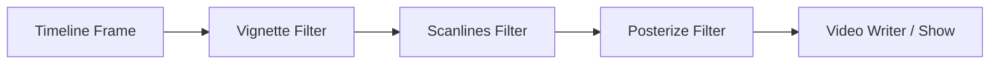

# Introducción

La demo es una pieza de software artístico procedural de 48 segundos de duración que corre a 30 FPS, estructurada en 6 escenas de 8 segundos cada una.

La paleta de colores se ha redefinido para usar exclusivamente tonos rojos y grises.

---

# 1. Estructura de las Escenas y Ecuaciones

## Escena 0: Créditos
* **Fondo**: Degradado vertical de gris muy oscuro (valor 15) a gris medio (valor 90), con una sutil onda sinusoidal dinámica sobre el brillo:
  $$\text{Valor}(y, t) = 35 + 40(1 - y) + 4.8\sin(1.2t + 2y)$$
* **Estrellas Procedurales**: Se generan 380 coordenadas pseudoaleatorias fijando una semilla determinista (`np.random.default_rng(1)`). Para mantener la coherencia de color, los píxeles se colorean usando indexación avanzada de NumPy divididos en tercios:
  * Rojo BGR `[50, 50, 240]`
  * Blanco BGR `[220, 220, 220]`
  * Gris BGR `[160, 160, 160]`
* **Efecto Glow (Resplandor de Neón)**: El texto principal `"DEMO PROCEDURAL"` se dibuja dos veces usando `cv2.putText`:
  1. Primero con un grosor de `5` y un color rojo oscuro, sirviendo como halo de resplandor.
  2. Encima con un grosor de `2` y un color rojo brillante/blanquecino para el núcleo del texto.

---

## Escena 1: Curva de Lissajous
* **Propósito**: Dibujar figuras geométricas tridimensionales oscilantes proyectadas en 2D.
* **Ecuaciones Matemáticas**:
  $$x(\theta) = \sin(a \cdot \theta + \delta)$$
  $$y(\theta) = \sin(b \cdot \theta)$$
  Donde $\theta \in [0, 2\pi]$.
* **Parámetros Dinámicos**:
  Para hacer que la curva oscile y cambie de forma con el tiempo $t$:
  * Frecuencia en X: $a(t) = 5 + 1.5\sin(t)$
  * Frecuencia en Y: $b(t) = 4 + 1.2\cos(1.2t)$
  * Diferencia de Fase: $\delta(t) = \frac{\pi}{4} + 0.8\sin(1.5t)$
* **Aplicación**: Renders en un fondo degradado rojo profundo. El color de la curva transiciona su saturación en HSV en función de $\sin(2.5t)$, pasando de blanco/gris a rojo brillante. Se aplica el efecto *glow* dibujando la curva primero con grosor `5` (rojo oscuro difuminado) y luego con grosor `2` (color base).

---

## Escena 2: Flor
* **Propósito**: Generar curvas simétricas en forma de pétalos florales que giran sobre su propio eje.
* **Ecuaciones Matemáticas**:
  En coordenadas polares, la ecuación de una rosa es:
  $$r(\theta) = \cos(k \cdot \theta)$$
  Convertido a coordenadas cartesianas y aplicando rotación dinámica $\theta_0$:
  $$x(\theta) = r(\theta) \cdot \cos(\theta + \theta_0)$$
  $$y(\theta) = r(\theta) \cdot \sin(\theta + \theta_0)$$
  Donde $\theta \in [0, 2\pi]$ y la velocidad de rotación es $\theta_0(t) = 2.5t$.
* **Parámetros**:
  * $k = 6$: Define que la flor tenga exactamente 6 pétalos (número par implica $k$ pétalos cuando $k$ es par en esta ecuación específica).
* **Círculos "Beats"**: Se dibujan 8 círculos en la parte inferior de la pantalla cuyas posiciones X están espaciadas uniformemente. Sus radios se modulan de forma armónica según el tiempo y su índice:
  $$r_{\text{beat}}(t, i) = \max(1, 22 + 15\sin(6t + 0.8i))$$
  Los círculos alternan colores entre gris y rojo según si su índice $i$ es par o impar.

---

## Escena 3: Espirógrafo / Hipotrocoide
* **Propósito**: Simular un espirógrafo físico que dibuja trayectorias de curvas hipotrocoides que mutan en el espacio.
* **Ecuaciones Matemáticas**:
  $$x(\theta) = (R - r)\cos(\theta) + d\cos\left(\frac{R - r}{r}\theta + \phi_x(t)\right)$$
  $$y(\theta) = (R - r)\sin(\theta) - d\sin\left(\frac{R - r}{r}\theta + \phi_y(t)\right)$$
  Donde $\theta \in [0, 16\pi]$ para cerrar el ciclo de vueltas del engranaje.
* **Parámetros**:
  * Radio del círculo mayor: $R = 13.0$
  * Radio del círculo menor: $r = 5.0$
  * Distancia del punto de lápiz: $d = 8.0$
  * Moduladores de fase: $\phi_x(t) = 0.4\sin(1.8t)$ y $\phi_y(t) = 0.4\cos(1.5t)$
* **Aplicación**: Genera curvas densas y entrelazadas sobre un fondo rojo. La fase de rotación oscilan con el tiempo.

---

## Escena 4: Partículas
* **Propósito**: Mostrar un flujo constante de partículas.
* **Ecuaciones Matemáticas**:
  Se posicionan 1200 partículas de forma aleatoria y se recalculan sus desplazamientos mediante ondas sinusoidales cruzadas dependientes del tiempo:
  $$x_{\text{new}} = (x + 110\sin(y/55.0 + 4t) + 40\cos(1.8t)) \pmod W$$
  $$y_{\text{new}} = (y + 85\cos(x/75.0 + 3t) + 30\sin(2.2t)) \pmod H$$
* **Aplicación**: Las partículas se dividen en dos grupos (mitad rojas y mitad grises). Se aplica un ligero desenfoque gaussiano de radio `1.1` para simular dispersión de luz y profundidad.

---

## Escena 5: Fuego Procedural
* **Propósito**: Simular la convección física y radiación térmica de una llama usando matrices de calor y colorización HSV.
* **Algoritmo y Ecuaciones**:
  1. **Disipación (Enfriamiento)**: En cada frame, la matriz de calor se multiplica por un factor de enfriamiento:
     $$Heat_{t}(y, x) = Heat_{t-1}(y, x) \times 0.93$$
  2. **Inyección de Calor**: En la base (zona inferior, $y \in [0.82H, H]$), se inyectan 1400 puntos de calor con valores aleatorios modulados por un pulso oscilante:
     $$Heat(y, x) += \text{random} \times (0.8 + 0.6(0.5 + 0.5\sin(5t)))$$
  3. **Convección**: El calor sube debido a que los datos de la matriz se desplazan 2 píxeles hacia arriba en cada iteración:
     $$Heat(y - 2, x) = Heat(y, x)$$
  4. **Difusión (Blur)**: Se aplica un desenfoque gaussiano ($\sigma = 2.2$) a la matriz de calor para simular la disipación térmica del aire.
  5. **Mapeo a Color (HSV)**: La matriz de calor de valores flotantes se mapea a canales HSV de OpenCV:
     * **Tono (H)**: $0$ (Rojo puro para todo el rango).
     * **Saturación (S)**: Se reduce drásticamente para las temperaturas más altas para volver blanco/gris el núcleo de la llama:
       $$S = 245 \times \left(1.0 - \text{clip}(Heat - 0.4, 0.0, 0.6) \times 1.6\right)$$
     * **Valor (V)**: Aumenta proporcionalmente al calor:
       $$V = 15 + 240 \times \text{clip}(Heat, 0.0, 1.0)$$
  6. **Elementos Adicionales**: Se dibuja un suelo rectangular de color gris carbón y se superponen 160 chispas de color mezclado (rojo y gris) que suben de forma difusa.

---

# 2. Transformaciones de Coordenadas e Interpolaciones

## Muestreo y Transformación de Pantalla (`poly_param`)
Las funciones matemáticas continuas se transforman a coordenadas de píxeles discretas en pantalla a través de la función `poly_param`:
1. **Muestreo**: Se evalúa la función sobre un rango denso usando `np.linspace(t0, t1, n)`.
2. **Escalamiento y Traslación**: Los valores continuos de la función (cuyos rangos suelen ser $[-1, 1]$) se escalan mediante factores de tamaño ($s_x, s_y$) y se trasladan a los centros de pantalla ($c_x, c_y$):
   $$X_{\text{pixel}} = X_{\text{continuo}} \cdot s_x + c_x$$
   $$Y_{\text{pixel}} = Y_{\text{continuo}} \cdot s_y + c_y$$
3. **Discretización**: Los valores de punto flotante se redondean a enteros (`np.round`) y se reformatean a un arreglo de tipo `np.int32` con dimensiones `(-1, 1, 2)`, compatible con los algoritmos de dibujo vectorial de OpenCV (`cv2.polylines`).

---

## Interpolación de Transición (`smoothstep`)
Para realizar la mezcla de escenas e intensidades globales se utiliza la función `smoothstep`, una interpolación polinómica hermítica de tercer orden que suaviza la aceleración en los extremos en comparación con una interpolación lineal convencional:
$$\text{smoothstep}(a, b, x) = 3y^2 - 2y^3 \quad \text{donde } y = \text{clamp}\left(\frac{x - a}{b - a}, 0, 1\right)$$

* **Mezcla de Fotogramas**: En los últimos 1.2 segundos de cada escena, se calcula la interpolación $a = \text{smoothstep}(6.8, 8.0, t_{\text{local}})$. Se mezclan las imágenes usando combinación lineal ponderada:
  $$\text{Frame} = \text{BufA} \cdot (1 - a) + \text{BufB} \cdot a$$
* **Destello de Transición**: Un pequeño destello de luz blanca transiciona en el último instante mediante el peso de color blanco:
  $$\text{Frame} = \text{Frame} \cdot 1.0 + \text{Blanco} \cdot (0.12 \cdot \text{smoothstep}(7.6, 8.0, t_{\text{local}}))$$
* **Fade Global**: Se aplica un fade-in lineal suavizado en los primeros 1.5 segundos del vídeo general, y un fade-out simétrico en los últimos 1.5 segundos.

---

# 3. Filtros de Posprocesamiento

Al finalizar la renderización de cada fotograma, se le aplican tres filtros en cascada en la función `main` para mejorar la textura de la imagen:

```python
frame = post_vignette(frame, 0.72)
frame = post_scanlines(frame, 0.16)
frame = post_posterize(frame, 24)
```



### A. Viñeteado (`post_vignette`)
* **Ecuación**:
  Para cada coordenada $(x, y)$, se calcula la distancia cuadrática normalizada al centro de la pantalla:
  $$d_{\text{norm}}(x, y) = \left(\frac{x - W/2}{W/2}\right)^2 + \left(\frac{y - H/2}{H/2}\right)^2$$
  El brillo del píxel se atenúa en función de esta distancia multiplicada por la fuerza $S_{\text{vignette}} = 0.72$:
  $$\text{Píxel}_{\text{out}} = \text{Píxel}_{\text{in}} \times \text{clamp}(1.0 - S_{\text{vignette}} \cdot d_{\text{norm}}(x, y), 0.0, 1.0)$$
* **Por qué se aplica**: Simula las características de las lentes de cámaras analógicas clásicas, oscureciendo los bordes de la pantalla.

### B. Líneas de Escaneo (`post_scanlines`)
* **Ecuación**:
  Se aplica un patrón oscilatorio sinusoidal horizontal dependiente únicamente de la fila vertical $y$:
  $$\text{Modulación}(y) = 1.0 - S_{\text{scan}} \cdot \left(0.5 + 0.5\sin\left(\frac{2\pi y}{3}\right)\right)$$
  Donde la fuerza del filtro es $S_{\text{scan}} = 0.16$.
* **Por qué se aplica**: Este filtro rompe la "limpieza" artificial de los gráficos digitales planos, dándole textura de pantalla analógica de fósforo y ocultando la pixelación dura del aliasing.

### C. Posterización (`post_posterize`)
* **Ecuación**:
  Se realiza una cuantización de niveles de color dividiendo los canales de los píxeles por un factor de paso $Q = 24$, aplicando división entera y luego volviendo a multiplicar:
  $$\text{Color}_{\text{out}} = \left\lfloor \frac{\text{Color}_{\text{in}}}{Q} \right\rfloor \times Q$$
* **Por qué se aplica**: Reduce la cantidad de colores disponibles en la imagen de 256 niveles a aproximadamente 10 niveles discretos por canal. 


# Resumen

### 1. Escenas y Ecuaciones

| Escena | Ecuación / Lógica principal | Comportamiento dinámico |
| :--- | :--- | :--- |
| **0. Créditos** | Posicionamiento determinista de estrellas. | Estrellas en rojo, blanco y gris. Texto en rojo con efecto de resplandor (*glow*). |
| **1. Lissajous** | $x = \sin(a\theta + \delta)$<br>$y = \sin(b\theta)$ | Las frecuencias ($a, b$) y la fase ($\delta$) varían con $\sin(t)$. El color oscila de rojo a blanco. |
| **2. Rosa Polar** | $r = \cos(6\theta)$<br>Rotación: $\theta + 2.5t$ | Flor de 6 pétalos giratoria. Abajo, 8 círculos con radios pulsantes que alternan rojo y gris. |
| **3. Espirógrafo** | Ecuación de hipotrocoide. | Curva compleja cuyos extremos oscilan dinámicamente con la fase $\phi(t)$. |
| **4. Partículas** | Deriva por campo de viento sinusoidal en X e Y. | 1200 partículas flotantes: 50% rojas y 50% grises con desenfoque gaussiano suave. |
| **5. Fuego** | Disipación de calor ($0.93$) + Convección hacia arriba + Gaussian Blur. | Matriz de calor coloreada en HSV (Tono 0 para rojo; saturación baja en el centro para dar gris/blanco). |

---

### 2. Transformaciones e Interpolaciones
* **Ajuste de pantalla (`poly_param`)**: Transforma las coordenadas continuas matemáticas $[-1, 1]$ a coordenadas discretas de píxeles:
  $$X_{\text{pixel}} = X \cdot \text{escala} + \text{centro}$$
* **Transiciones (`smoothstep`)**: Interpolación cúbica ($3u^2 - 2u^3$) para lograr desvanecimientos suaves en la entrada, salida y cambio entre escenas.

---

### 3. Filtros de Posprocesamiento

* **Vignette (Viñeteado)**: Oscurece los bordes en forma radial.
  * *Por qué*: Dirige la mirada del espectador al centro y aporta aspecto cinematográfico.
* **Scanlines (Líneas de escaneo)**: Modulación sinusoidal horizontal del brillo.
  * *Por qué*: Simula un monitor CRT retro y suaviza los bordes duros de los vectores.
* **Posterizado (Quantización)**: Agrupa el color en intervalos de 24 niveles.
  * *Por qué*: Reduce los gradientes suaves de color para dar un aspecto estilizado de videojuego clásico o *pixel-art*.


